# Assembly instructions

## Stick the two halves of the motherboard together

You have to stick together the two halves of 
the motherboard: 

Pay attention to the correct alignment 
of the halves: 

And that's it: 

Now, I've soldered the connectors board according to 
the given schematics:

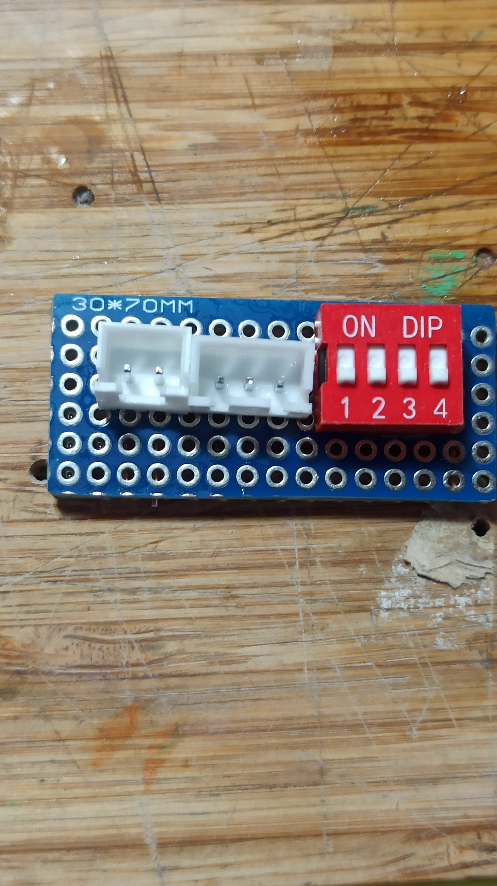

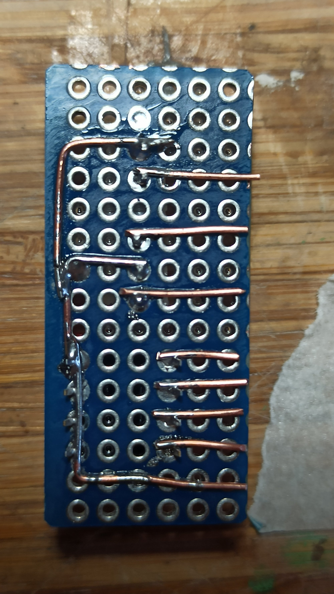

Next part, solder a black cable or aproximately 
7 cm on every part (later we will solder them 
together): 

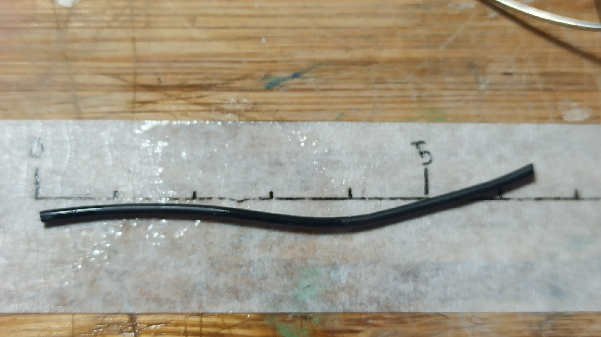

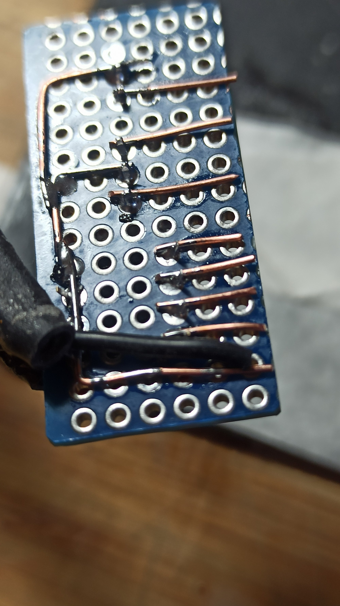

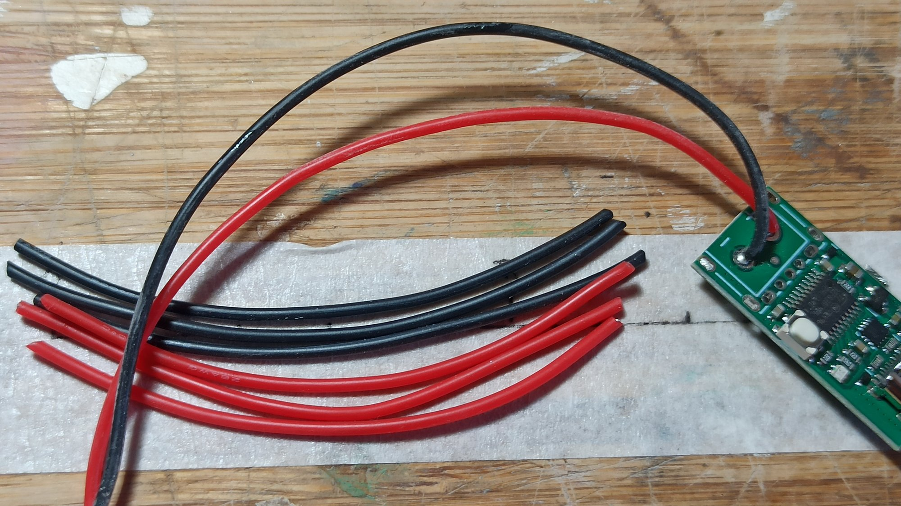

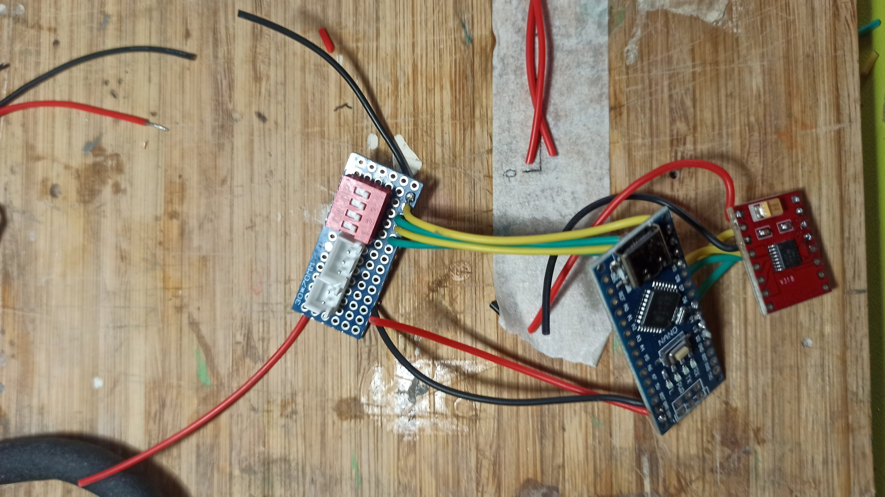

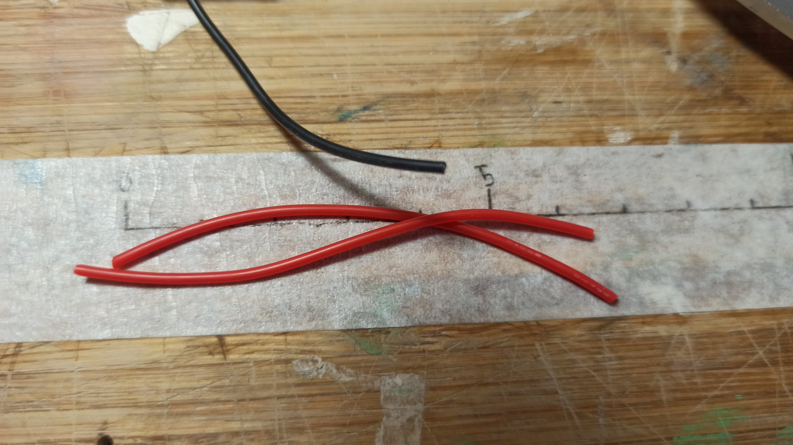

Cut 4 wires (I've cut of two idfferent colors, but that 
is not important): 

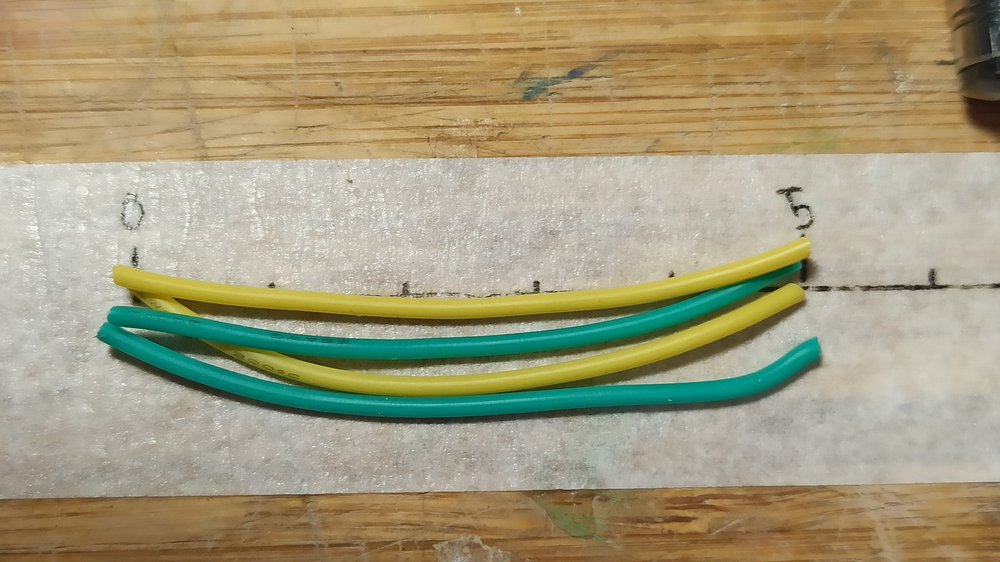

And solder together the Arduino with the motor driver: 

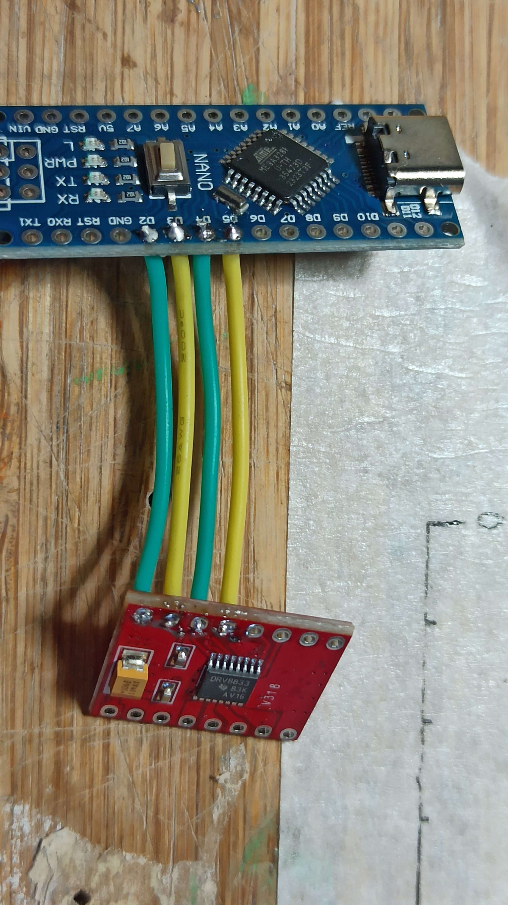

ESTA PARTE LA CAMBIAREMOS POR UN BOTON: 

Next, cut four 7cm wires for the dip switches:

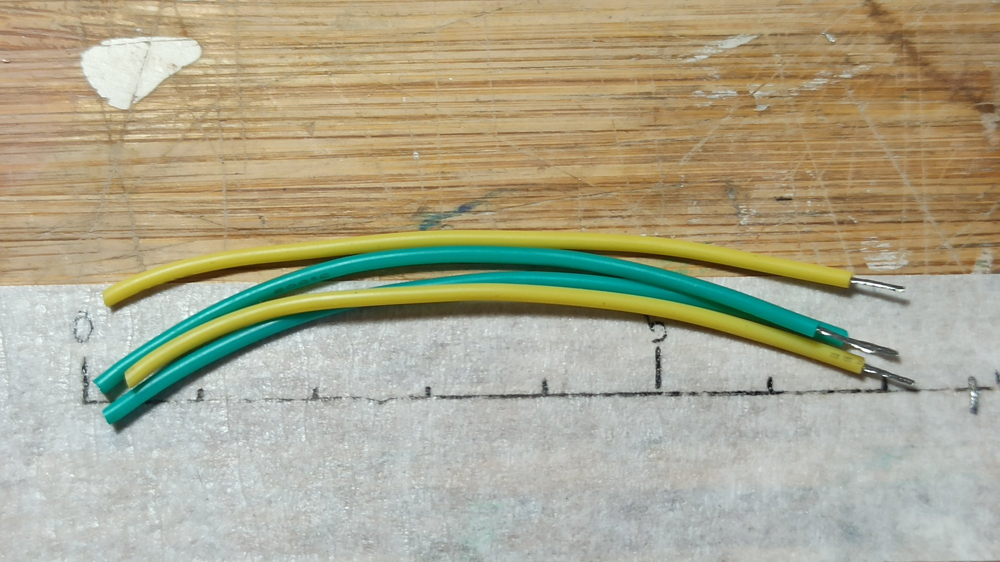

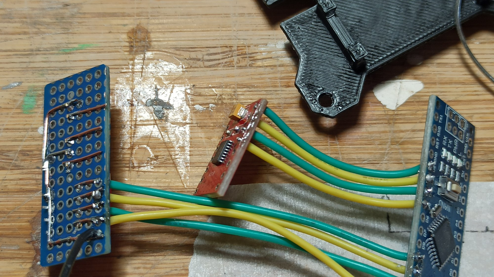

