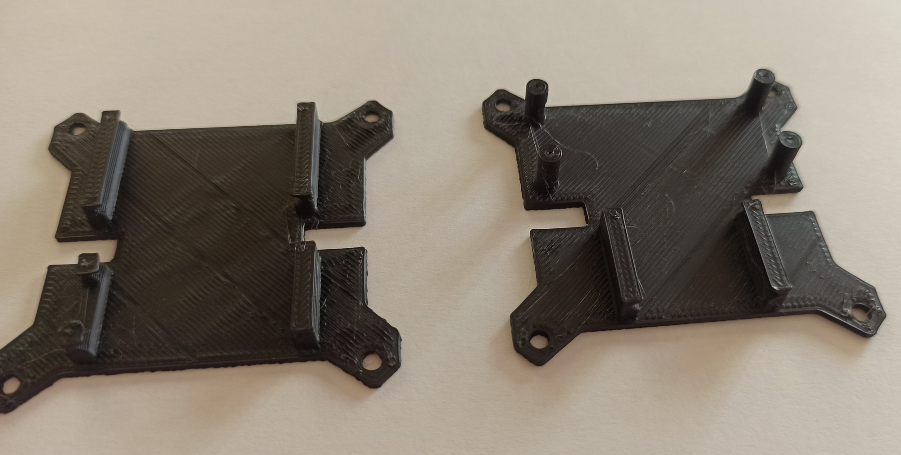
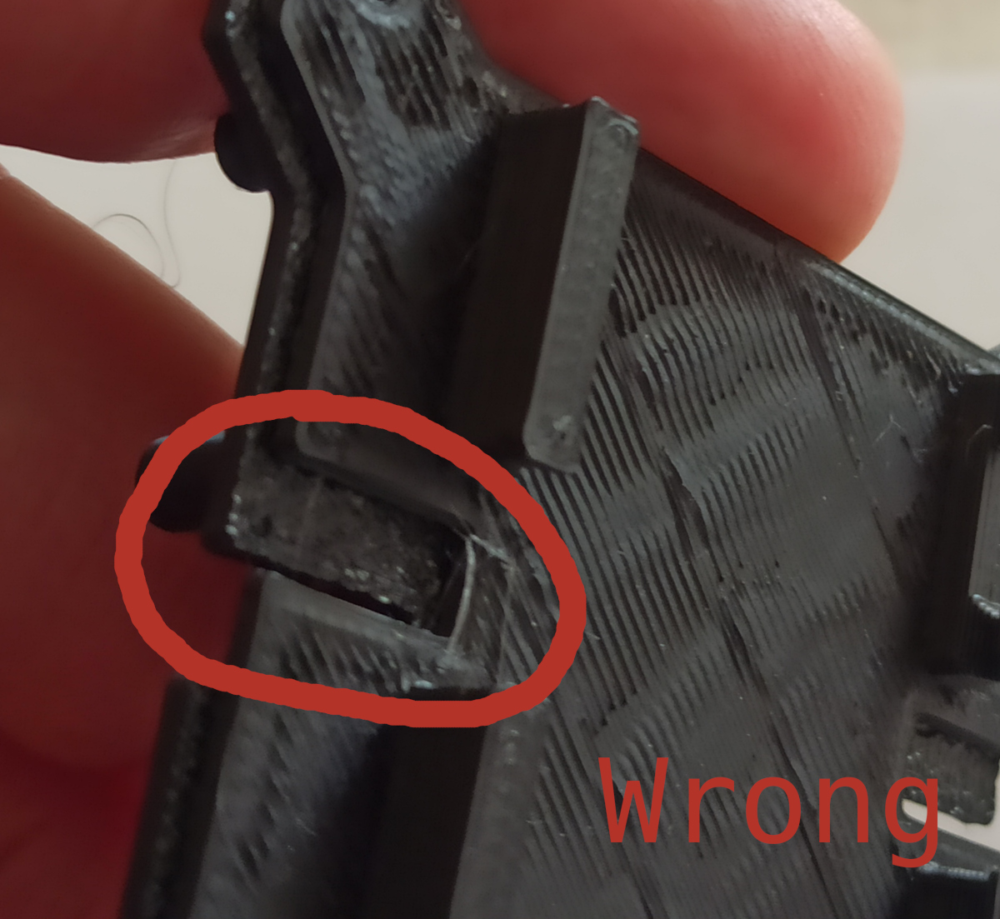
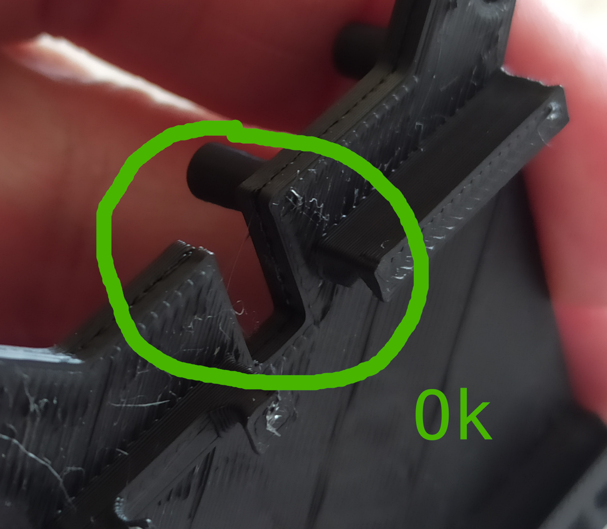
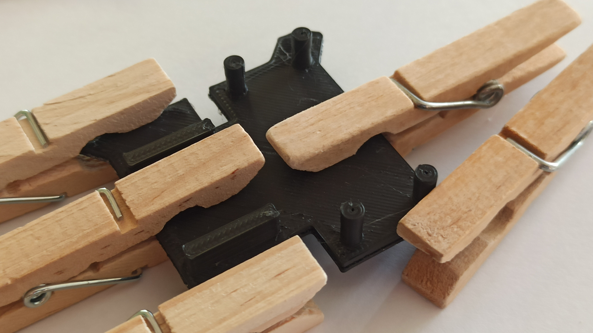

# Assembly instructions

## Stick the two halves of the motherboard together

You have to stick together the two halves of 
the motherboard: 

Pay attention to the correct alignment 
of the halves: 

And that's it: 

